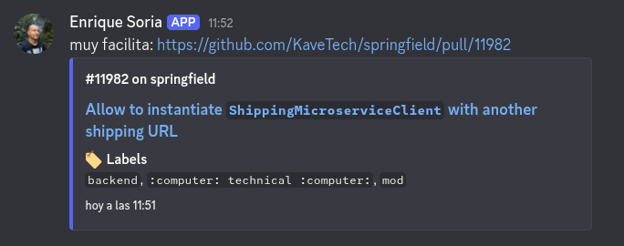

# GithubDiscordBot
A command for a discord bot to send private pull requests with a rich preview in Discord.

This repo contains:
 - Multiple installable cogs for your Discord bot:
    - `PullRequestsReplacer`: Automatically replaces GitHub PR URLs with a rich preview using a webhook (mimics the original user).
    - `PullRequestsReplier`: Responds to GitHub PR URLs with a rich preview.
    - `PullRequestsCommand`: Provides the `/pull_request` slash command.
 - A simple Discord bot that already includes the `PullRequestsReplacer` cog.




## How to run the bot
 - Populate .env: `cp .env.sample .env`
 - Fill the .env with as desired (requires `GITHUB_TOKEN` and either `ALLOWED_REPO_NAMES` or `ALLOWED_ORGANIZATIONS`)
 - Run bot: `make`

## Use it (in discord)
If you are using `PullRequestsReplacer` or `PullRequestsReplier`, simply paste a GitHub Pull Request URL in a message.

If you are using `PullRequestsCommand`:
`/pull_request https://github.com/owner/repo/pull/123`


# Install one of the cogs in your Discord bot
1. Install the library:
```shell
pip install https://github.com/EnriqueSoria/github_discord.git
```

2. Instantiate the cog and add it to your bot. See [src/main.py](src/main.py) for an example.
